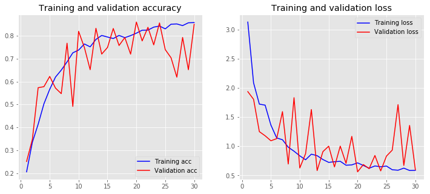
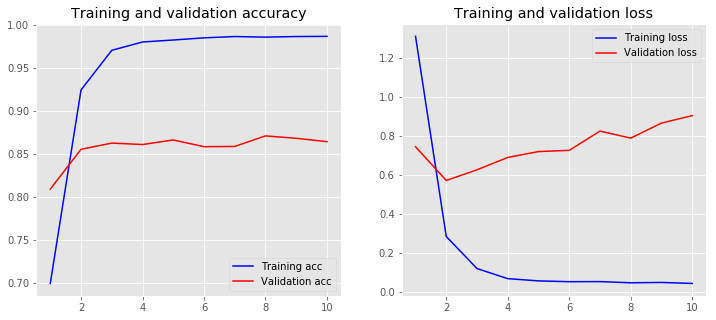
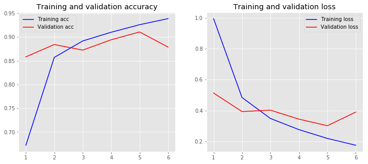

# Text Classification

文本分类（Text Classification）是自然语言处理中的一个重要应用技术，根据文档的内容或主题，自动识别文档所属的预先定义的类别标签。文本分类是很多应用场景的基础，比如垃圾邮件识别，舆情分析，情感识别，新闻自动分类，智能客服机器人的知识库分类等等。本文分为两个部分：

- Part 1: 基于scikit-learn机器学习Python库，对比几个传统机器学习方法的文本分类。[Blog Post](https://lijqhs.github.io/2019/05/text-classification-scikit-learn/)
- Part 2: 基于预训练词向量模型，使用Keras工具进行文本分类，用到了CNN。[Blog Post](https://lijqhs.github.io/2019/05/text-classification-pretrained-keras-cnn/)

本文语料：[下载链接](https://pan.baidu.com/s/1Z4nMw-Eem0C71m8djI-OAA)，密码:P9M4。更多新闻标注语料，[下载链接](http://www.sogou.com/labs/resource/list_news.php)。


预训练词向量模型来自[GitHub：Chinese Word Vectors 上百种预训练中文词向量](https://github.com/Embedding/Chinese-Word-Vectors)，下载地址：[Sogou News 300d](https://pan.baidu.com/s/1tUghuTno5yOvOx4LXA9-wg)。

<!-- TOC -->

- [Text Classification](#text-classification)
    - [Part 1: 基于scikit-learn机器学习的文本分类方法](#part-1-基于scikit-learn机器学习的文本分类方法)
        - [1. 语料预处理](#1-语料预处理)
        - [2. 生成训练集和测试集](#2-生成训练集和测试集)
            - [生成数据集](#生成数据集)
        - [3. 文本特征提取:TF-IDF](#3-文本特征提取tf-idf)
        - [4. 构建分类器](#4-构建分类器)
            - [Benchmark: 朴素贝叶斯分类器](#benchmark-朴素贝叶斯分类器)
            - [对新文本应用分类](#对新文本应用分类)
        - [5. 分类器的评估](#5-分类器的评估)
            - [构建Logistic Regression分类器](#构建logistic-regression分类器)
            - [构建SVM分类器](#构建svm分类器)
    - [Part 2: 基于预训练模型的CNN文本分类方法-Keras](#part-2-基于预训练模型的cnn文本分类方法-keras)
        - [1. 读取语料](#1-读取语料)
        - [2. 加载预训练词向量模型](#2-加载预训练词向量模型)
        - [3. 使用Keras对语料进行处理](#3-使用keras对语料进行处理)
        - [4. 定义词嵌入矩阵](#4-定义词嵌入矩阵)
            - [Embedding Layer](#embedding-layer)
        - [5. 构建模型](#5-构建模型)
        - [参考资料](#参考资料)

<!-- /TOC -->

## Part 1: 基于scikit-learn机器学习的文本分类方法

基于scikit-learn机器学习的中文文本分类主要分为以下步骤：

1. 语料预处理
2. 生成训练集和测试集
3. 文本特征提取:TF-IDF
4. 构建分类器
5. 分类器的评估

### 1. 语料预处理

定义搜狗新闻文本标签的名称，类似`C000008`这样的标签是语料的子目录，在网上搜到标签对应的新闻类别，为了便于理解，定义了这个映射词典，并保留原有编号信息。在网上搜索下载`搜狗分类新闻.20061127.zip`语料并解压至`CN_Corpus`目录下，解压之后目录结构为：

```
CN_Corpus
└─SogouC.reduced
    └─Reduced
        ├─C000008
        ├─C000010
        ├─C000013
        ├─C000014
        ├─C000016
        ├─C000020
        ├─C000022
        ├─C000023
        └─C000024
```

```python
category_labels = {
    'C000008': '_08_Finance',
    'C000010': '_10_IT',
    'C000013': '_13_Health',
    'C000014': '_14_Sports',
    'C000016': '_16_Travel',
    'C000020': '_20_Education',
    'C000022': '_22_Recruit',
    'C000023': '_23_Culture',
    'C000024': '_24_Military'
}
```

下面进行语料的切分，将每个类别的前80%作为训练语料，后20%作为测试语料。切分完之后的语料目录如下：
```
data
├─test
│  ├─_08_Finance
│  ├─_10_IT
│  ├─_13_Health
│  ├─_14_Sports
│  ├─_16_Travel
│  ├─_20_Education
│  ├─_22_Recruit
│  ├─_23_Culture
│  └─_24_Military
└─train
    ├─_08_Finance
    ├─_10_IT
    ├─_13_Health
    ├─_14_Sports
    ├─_16_Travel
    ├─_20_Education
    ├─_22_Recruit
    ├─_23_Culture
    └─_24_Military
```


### 2. 生成训练集和测试集

#### 生成数据集

从上面切分好的语料目录中读取文本并进行分词预处理，输出：训练语料数据(`X_train_data`)、训练语料标签(`y_train`)、测试语料数据(`X_test_data`)、测试语料标签(`y_test`)。


```python
X_train_data, y_train, X_test_data, y_test = load_datasets()
```

    label: _08_Finance, len: 1500
    label: _10_IT, len: 1500
    label: _13_Health, len: 1500
    label: _14_Sports, len: 1500
    label: _16_Travel, len: 1500
    label: _20_Education, len: 1500
    label: _22_Recruit, len: 1500
    label: _23_Culture, len: 1500
    label: _24_Military, len: 1500
    train corpus len: 13500

    label: _08_Finance, len: 490
    label: _10_IT, len: 490
    label: _13_Health, len: 490
    label: _14_Sports, len: 490
    label: _16_Travel, len: 490
    label: _20_Education, len: 490
    label: _22_Recruit, len: 490
    label: _23_Culture, len: 490
    label: _24_Military, len: 490
    test corpus len: 4410

数据集的形式如下：

```python
X_train_data[1000]
```

    '新华网 上海 月 日电 记者 黄庭钧 继 日 人民币 兑 美元 中间价 突破 关口 创 历史 新高 后 日 人民币 兑 美元汇率 继续 攀升 中国外汇交易中心 日 公布 的 中间价 为 再刷 历史 新高 大有 逼近 和 突破 心理 关口 之势 据 兴业银行 资金 营运 中心 交易员 余屹 介绍 人民币 兑 美元汇率 日 走势 继续 表现 强劲 竞价 交易 以 开盘 后 最低 曾 回到 最高 则 触及 距 关口 仅 一步之遥 收报 而 询价 交易 亦 表现 不俗 以 开盘 后 曾经 走低 到 最高 仅触 到 截至 时 分 报收 虽然 全日 波幅 较窄 但 均 在 下方 有 跃跃欲试 关口 之 态势 完'

```python
y_train[1000]
```

    '_08_Finance'


### 3. 文本特征提取:TF-IDF

这个步骤将文档信息，也即每篇新闻被分好词之后的词集合，转为为基于词频-你文档词频（TF-IDF）的向量，向量的每个元素都是对应于某个词在这个文档中的TF-IDF值，在不同文档中，同一词的TF-IDF是不一样的。所有文档的TF-IDF向量堆放在一起就组成了一个TF-IDF矩阵。注意到这里应该包含了除停用词之外的所有词的TF-IDF值，词的个数构成了向量的维度。   

用`TfidfVectorizer`将文档集合转为`TF-IDF`矩阵。注意到前面我们将文本做了分词并用空格隔开。如果是英文，本身就是空格隔开的，而英文的分词（Tokenizing）是包含在特征提取器中的，不需要分词这一步骤。下面我们在得到了分类器之后，使用新文本进行分类预测时，也是需要先做一下中文分词的。

```python
stopwords = open('dict/stop_words.txt', encoding='utf-8').read().split()

# TF-IDF feature extraction
tfidf_vectorizer = TfidfVectorizer(stop_words=stopwords)
X_train_tfidf = tfidf_vectorizer.fit_transform(X_train_data)
words = tfidf_vectorizer.get_feature_names()
```

```python
X_train_tfidf.shape
```

    (13500, 223094)

```python
len(words)
```

    223094

### 4. 构建分类器

#### Benchmark: 朴素贝叶斯分类器

得到了训练样本的文本特征，现在可以训练出一个分类器，以用来对新的新闻文本进行分类。`scikit-learn`中提供了多种分类器，其中[朴素贝叶斯](https://scikit-learn.org/stable/modules/naive_bayes.html#naive-bayes)是一个很好的基准，有多个版本的朴素贝叶斯分类器，其中[`MultinomialNB`](https://scikit-learn.org/stable/modules/naive_bayes.html#multinomial-naive-bayes)比较适合于文本分类。

```python
classifier = MultinomialNB()
classifier.fit(X_train_tfidf, y_train)
```

    MultinomialNB(alpha=1.0, class_prior=None, fit_prior=True)

#### 对新文本应用分类

对新的文本需要进行分类，那么只需将上面的`tfidf_vectorizer`应用在新的文本上，调用`transform`方法而不是`fit_transform`，将新的文本转换为`TF-IDF`特征，然后再调用分类器的`predict`，得到分类。   

下面新闻节选自腾讯新闻网，原文地址：

- [周鸿祎金融梦，营收20亿元直逼趣店，净利润同比增340％](https://new.qq.com/omn/20190521/20190521A08M6V.html)
- [录取率低过5％的美国名校，为何“花钱”就能上？](https://new.qq.com/omn/20190503/20190503A03SIG.html)
- [特朗普：伊朗对美军动武将会“灭亡”](https://new.qq.com/omn/20190520/20190520A0D4LA.html)

```python
news_lastest = ["360金融旗下产品有360借条、360小微贷、360分期。360借条是360金融的核心产品，是一款无抵押、纯线上消费信贷产品，为用户提供即时到账贷款服务（通俗可以理解为“现金贷”）用户借款主要用于消费支出。从收入构成来看，360金融主要有贷款便利服务费、贷后管理服务费、融资收入、其他服务收入等构成。财报披露，营收增长主要是由于贷款便利化服务费、贷款发放后服务费和其他与贷款发放量增加相关的服务费增加。",
                "检方并未起诉全部涉嫌贿赂的家长，但起诉名单已有超过50人，耶鲁大学、斯坦福大学等录取率极低的名校涉案也让该事件受到了几乎全球的关注，该案甚至被称作美国“史上最大招生舞弊案”。",
                "俄媒称，目前尚不清楚特朗普这一言论的指向性，因为近几日，伊朗官员们都在表达力图避免与美国发生军事冲突的意愿。5月19日早些时候，伊朗革命卫队司令侯赛因·萨拉米称，伊朗只想追求和平，但并不害怕与美国发生战争。萨拉米称，“我们（伊朗）和他们（美国）之间的区别在于，美国害怕发生战争，缺乏开战的意志。”"]
X_new_data = [preprocess(doc) for doc in news_lastest]
X_new_data
```

    ['金融 旗下 产品 有 借条 小微贷 分期 借条 是 金融 的 核心 产品 是 一款 无 抵押 纯线 上 消费信贷 产品 为 用户 提供 即时 到 账 贷款 服务 通俗 可以 理解 为 现金 贷 用户 借款 主要 用于 消费 支出 从 收入 构成 来看 金融 主要 有 贷款 便利 服务费 贷后 管理 服务费 融资 收入 其他 服务收入 等 构成 财报 披露 营收 增长 主要 是 由于 贷款 便利化 服务费 贷款 发放 后 服务费 和 其他 与 贷款 发放量 增加 相关 的 服务费 增加',
     '检方 并未 起诉 全部 涉嫌 贿赂 的 家长 但 起诉 名单 已有 超过 人 耶鲁大学 斯坦福大学 等 录取率 极低 的 名校 涉案 也 让 该 事件 受到 了 几乎 全球 的 关注 该案 甚至 被称作 美国 史上 最大 招生 舞弊案',
     '俄媒称 目前 尚 不 清楚 特朗普 这一 言论 的 指向性 因为 近几日 伊朗 官员 们 都 在 表达 力图 避免 与 美国 发生 军事冲突 的 意愿 月 日 早些时候 伊朗 革命 卫队 司令 侯赛因 · 萨拉米 称 伊朗 只想 追求 和平 但 并 不 害怕 与 美国 发生 战争 萨拉米 称 我们 伊朗 和 他们 美国 之间 的 区别 在于 美国 害怕 发生 战争 缺乏 开战 的 意志']

```python
X_new_tfidf = tfidf_vectorizer.transform(X_new_data)
```

```python
predicted  = classifier.predict(X_new_tfidf)
predicted
```

    array(['_08_Finance', '_20_Education', '_24_Military'], dtype='<U13')

### 5. 分类器的评估

有了分类器，以及知道了如何用分类器来对新的文本进行分类预测，那么我们可以用前面划分出来的测试集对这个分类器进行性能评估。我们得到了84.35%的准确率，作为Benchmark，这个结果还不错。调用`classification_report`可以得到更详细的结果：

```python
print(classification_report(y_test, predicted))
```

                   precision    recall  f1-score   support

      _08_Finance       0.88      0.88      0.88       488
           _10_IT       0.72      0.87      0.79       403
       _13_Health       0.82      0.84      0.83       478
       _14_Sports       0.95      1.00      0.97       466
       _16_Travel       0.86      0.92      0.89       455
    _20_Education       0.71      0.87      0.79       401
      _22_Recruit       0.91      0.65      0.76       690
      _23_Culture       0.80      0.77      0.79       513
     _24_Military       0.94      0.89      0.92       516

         accuracy                           0.84      4410
        macro avg       0.84      0.86      0.84      4410
     weighted avg       0.85      0.84      0.84      4410


再看一下混淆矩阵：

```python
confusion_matrix(y_test, predicted)
```

    array([[429,  12,  15,  10,   5,   3,   6,   4,   4],
           [ 20, 352,   6,   3,   5,   2,  10,   4,   1],
           [  3,  38, 403,   0,   6,  16,   5,   7,   0],
           [  0,   1,   0, 464,   0,   0,   0,   1,   0],
           [  5,  11,   0,   0, 419,   5,   2,  12,   1],
           [  4,  11,   5,   1,   2, 350,  13,  14,   1],
           [ 22,  21,  57,   8,  14,  87, 448,  32,   1],
           [  3,  25,   4,   4,  34,  23,   5, 394,  21],
           [  4,  19,   0,   0,   5,   4,   1,  22, 461]])

#### 构建Logistic Regression分类器

让我们再试一下其他的分类器，比如`Logistic Regression`，训练新的分类器：

```python
text_clf_lr = Pipeline([
    ('vect', TfidfVectorizer()),
    ('clf', LogisticRegression()),
])
```

                   precision    recall  f1-score   support
    
      _08_Finance       0.87      0.91      0.89       465
           _10_IT       0.77      0.86      0.81       440
       _13_Health       0.91      0.82      0.86       546
       _14_Sports       0.98      0.99      0.98       483
       _16_Travel       0.90      0.90      0.90       488
    _20_Education       0.79      0.91      0.85       429
      _22_Recruit       0.86      0.85      0.85       495
      _23_Culture       0.86      0.75      0.80       556
     _24_Military       0.95      0.92      0.93       508
    
         accuracy                           0.88      4410
        macro avg       0.88      0.88      0.88      4410
     weighted avg       0.88      0.88      0.88      4410
    
    
最后测试结果还行，比Benchmark分类器好了不少。

    array([[425,  11,   7,   1,   2,   4,   9,   5,   1],
           [ 23, 377,   4,   3,   9,   3,  12,   7,   2],
           [  9,  41, 447,   0,   6,  23,  10,  10,   0],
           [  0,   2,   0, 478,   0,   1,   0,   1,   1],
           [  8,  12,   0,   0, 440,   8,   3,  16,   1],
           [  1,   6,   2,   0,   1, 389,  20,  10,   0],
           [  8,   7,  22,   1,   5,  26, 420,   6,   0],
           [ 11,  23,   8,   6,  24,  30,  15, 419,  20],
           [  5,  11,   0,   1,   3,   6,   1,  16, 465]])

#### 构建SVM分类器

在传统机器学习中，SVM是做文本分类最好的工具。同样做一下跟上面LR一样的对比：

```python
text_clf_svm = Pipeline([
    ('vect', TfidfVectorizer()),
    ('clf', SGDClassifier(loss='hinge', penalty='l2')),
])
```

准确率不低：

                   precision    recall  f1-score   support
    
      _08_Finance       0.87      0.92      0.90       463
           _10_IT       0.78      0.85      0.81       446
       _13_Health       0.93      0.82      0.87       558
       _14_Sports       0.99      0.99      0.99       488
       _16_Travel       0.91      0.91      0.91       489
    _20_Education       0.82      0.92      0.86       437
      _22_Recruit       0.89      0.85      0.87       513
      _23_Culture       0.85      0.83      0.84       503
     _24_Military       0.96      0.91      0.93       513
    
         accuracy                           0.89      4410
        macro avg       0.89      0.89      0.89      4410
     weighted avg       0.89      0.89      0.89      4410

传统机器学习方法这样的结果非常不错了，而且实现方式非常简单实用。

    array([[428,  11,   5,   1,   5,   3,   5,   8,   0],
           [ 23, 382,   4,   0,   6,   8,  11,   7,   2],
           [  9,  39, 453,   0,   7,  19,  10,   9,   0],
           [  0,   1,   0, 485,   0,   2,   0,   1,   0],
           [  7,  14,   0,   0, 449,   7,   3,  14,   1],
           [  3,   7,   1,   1,   1, 403,  14,  15,   0],
           [ 12,   8,  22,   0,   4,  25, 437,   8,   0],
           [  4,  15,   5,   3,  15,  17,   9, 411,  19],
           [  4,  13,   0,   0,   3,   6,   1,  17, 468]])


## Part 2: 基于预训练模型的CNN文本分类方法-Keras

文本分类主要分为以下步骤：

1. 读取语料
2. 加载中文预训练词向量模型
3. 使用Keras进行数据预处理，生成训练集和测试集
4. 定义词嵌入矩阵
5. 构建模型

### 1. 读取语料

这里读取原始语料，划分训练集和测试集，放在了后面预处理部分。

```python
texts, labels = load_raw_datasets()
```

下表是转换后的标签表示：

|序号|标签|名称|分类编码|
|:------:|:------:|:------:|:------:|
|0|C000008|Finance|[1, 0, 0, 0, 0, 0, 0, 0, 0]|
|1|C000010|IT|[0, 1, 0, 0, 0, 0, 0, 0, 0]|
|2|C000013|Health|[0, 0, 1, 0, 0, 0, 0, 0, 0]|
|3|C000014|Sports|[0, 0, 0, 1, 0, 0, 0, 0, 0]|
|4|C000016|Travel|[0, 0, 0, 0, 1, 0, 0, 0, 0]|
|5|C000020|Education|[0, 0, 0, 0, 0, 1, 0, 0, 0]|
|6|C000022|Recruit|[0, 0, 0, 0, 0, 0, 1, 0, 0]|
|7|C000023|Culture|[0, 0, 0, 0, 0, 0, 0, 1, 0]|
|8|C000024|Military|[0, 0, 0, 0, 0, 0, 0, 0, 1]|

### 2. 加载预训练词向量模型

解压之后的中文预训练词向量模型的文件格式是文本文件，首行只有两个空格隔开的数字：词的个数和词向量的维度，从第二行开始格式为：词 数字1 数字2 …… 数字300，形式如下：

> 364180 300    
> 人民文学出版社 0.003146 0.582671 0.049029 -0.312803 0.522986 0.026432 -0.097115 0.194231 -0.362708 ......
> ......

```python
embeddings_index = load_pre_trained()
```

    Found 364180 word vectors, dimension 300

### 3. 使用Keras对语料进行处理

```python
from keras.preprocessing.text import Tokenizer
from keras.preprocessing.sequence import pad_sequences
from keras.utils import to_categorical
import numpy as np

MAX_SEQUENCE_LEN = 1000  # 文档限制长度
MAX_WORDS_NUM = 20000  # 词典的个数
VAL_SPLIT_RATIO = 0.2 # 验证集的比例

tokenizer = Tokenizer(num_words=MAX_WORDS_NUM)
tokenizer.fit_on_texts(texts)
sequences = tokenizer.texts_to_sequences(texts)

word_index = tokenizer.word_index
print(len(word_index)) # all token found
# print(word_index.get('新闻')) # get word index
dict_swaped = lambda _dict: {val:key for (key, val) in _dict.items()}
word_dict = dict_swaped(word_index) # swap key-value
data = pad_sequences(sequences, maxlen=MAX_SEQUENCE_LEN)

labels_categorical = to_categorical(np.asarray(labels))
print('Shape of data tensor:', data.shape)
print('Shape of label tensor:', labels_categorical.shape)

indices = np.arange(data.shape[0])
np.random.shuffle(indices)
data = data[indices]
labels_categorical = labels_categorical[indices]

# split data by ratio
val_samples_num = int(VAL_SPLIT_RATIO * data.shape[0])

x_train = data[:-val_samples_num]
y_train = labels_categorical[:-val_samples_num]
x_val = data[-val_samples_num:]
y_val = labels_categorical[-val_samples_num:]
```

代码中`word_index`表示发现的所有词，得到的文本序列取的是`word_index`中前面20000个词对应的索引，文本序列集合中的所有词的索引号都在20000之前：

```python
len(data[data>=20000])
0
```

我们可以通过生成的词索引序列和对应的索引词典查看原始文本和对应的标签：

```python
# convert from index to origianl doc
for w_index in data[0]:
    if w_index != 0:
        print(word_dict[w_index], end=' ')
```

    昆虫 大自然 歌手 昆虫 口腔 发出 昆虫 界 著名 腹部 一对 是从 发出 外面 一对 弹性 称作 声 肌 相连 发音 肌 收缩 振动 声音 空间 响亮 传到 ５ ０ ０ 米 求婚 听到 发音 部位 发音 声音 两 张开 蚊子 一对 边缘 支撑 两只 每秒 ２ ５ ０ ～ ６ ０ ０ 次 推动 空气 往返 运动 发出 微弱 声 来源 语文 

```python
category_labels[dict_swaped(labels_index)[argmax(labels_categorical[0])]]
```

    '_20_Education'


### 4. 定义词嵌入矩阵

下面创建一个词嵌入矩阵，用来作为上述文本集合词典（只取序号在前`MAX_WORDS_NUM`的词，对应了比较常见的词）的词嵌入矩阵，矩阵维度是`(MAX_WORDS_NUM, EMBEDDING_DIM)`。矩阵的每一行`i`代表词典`word_index`中第`i`个词的词向量。这个词嵌入矩阵是预训练词向量的一个子集。我们的新闻语料中很可能有的词不在预训练词向量中，这样的词在这个词向量矩阵中对应的向量元素都设为零。还记得上面用`pad_sequence`补充的`0`元素么，它对应在词嵌入矩阵的向量也都是零。在本例中，20000个词有92.35%在预训练词向量中。


```python
EMBEDDING_DIM = 300 # embedding dimension
embedding_matrix = np.zeros((MAX_WORDS_NUM+1, EMBEDDING_DIM)) # row 0 for 0
for word, i in word_index.items():
    embedding_vector = embeddings_index.get(word)
    if i < MAX_WORDS_NUM:
        if embedding_vector is not None:
            # Words not found in embedding index will be all-zeros.
            embedding_matrix[i] = embedding_vector
```

```python
nonzero_elements = np.count_nonzero(np.count_nonzero(embedding_matrix, axis=1))
nonzero_elements / MAX_WORDS_NUM
```

    0.9235

#### Embedding Layer

嵌入层的输入数据`sequence`向量的整数是文本中词的编码，前面看到这个获取序列编码的步骤使用了Keras的`Tokenizer API`来实现，如果不使用预训练词向量模型，嵌入层是用随机权重进行初始化，在训练中将学习到训练集中的所有词的权重，也就是词向量。在定义`Embedding`层，需要至少3个输入数据：

- `input_dim`：文本词典的大小，本例中就是`MAX_WORDS_NUM + 1`；
- `output_dim`：词嵌入空间的维度，就是词向量的长度，本例中对应`EMBEDDING_DIM`；
- `input_length`：这是输入序列的长度，本例中对应`MAX_SEQUENCE_LEN`。

本文中还多了两个输入参数`weights=[embedding_matrix]`和`trainable=False`，前者设置该层的嵌入矩阵为上面我们定义好的词嵌入矩阵，即不适用随机初始化的权重，后者设置为本层参数不可训练，即不会随着后面模型的训练而更改。这里涉及了`Embedding`层的几种使用方式：

- 从头开始训练出一个词向量，保存之后可以用在其他的训练任务中；
- 嵌入层作为深度学习的第一个隐藏层，本身就是深度学习模型训练的一部分；
- 加载预训练词向量模型，这是一种迁移学习，本文就是这样的示例。

### 5. 构建模型

Keras支持两种类型的模型结构：

- Sequential类，顺序模型，这个仅用于层的线性堆叠，最常见的网络架构
- Functional API，函数式API，用于层组成的有向无环图，可以构建任意形式的架构

为了有个对比，我们先不加载预训练模型，让模型自己训练词权重向量。`Flatten`层用来将输入“压平”，即把多维的输入一维化，这是嵌入层的输出转入全连接层(`Dense`)的必需的过渡。


```python
from keras.models import Sequential
from keras.layers import Dense, Flatten

input_dim = x_train.shape[1]

model1 = Sequential()
model1.add(Embedding(input_dim=MAX_WORDS_NUM+1, 
                    output_dim=EMBEDDING_DIM, 
                    input_length=MAX_SEQUENCE_LEN))
model1.add(Flatten())
model1.add(Dense(64, activation='relu', input_shape=(input_dim,)))
model1.add(Dense(64, activation='relu'))
model1.add(Dense(len(labels_index), activation='softmax'))

model1.compile(optimizer='rmsprop',
              loss='categorical_crossentropy',
              metrics=['accuracy'])

history1 = model1.fit(x_train, 
                    y_train,
                    epochs=30,
                    batch_size=128,
                    validation_data=(x_val, y_val))
```

    Train on 14328 samples, validate on 3582 samples
    Epoch 1/30
    14328/14328 [==============================] - 59s 4ms/step - loss: 3.1273 - acc: 0.2057 - val_loss: 1.9355 - val_acc: 0.2510
    Epoch 2/30
    14328/14328 [==============================] - 56s 4ms/step - loss: 2.0853 - acc: 0.3349 - val_loss: 1.8037 - val_acc: 0.3473
    Epoch 3/30
    14328/14328 [==============================] - 56s 4ms/step - loss: 1.7210 - acc: 0.4135 - val_loss: 1.2498 - val_acc: 0.5731
    ......
    Epoch 29/30
    14328/14328 [==============================] - 56s 4ms/step - loss: 0.5843 - acc: 0.8566 - val_loss: 1.3564 - val_acc: 0.6516
    Epoch 30/30
    14328/14328 [==============================] - 56s 4ms/step - loss: 0.5864 - acc: 0.8575 - val_loss: 0.5970 - val_acc: 0.8501


每个Keras层都提供了获取或设置本层权重参数的方法：

- `layer.get_weights()`：返回层的权重（`numpy array`）
- `layer.set_weights(weights)`：从`numpy array`中将权重加载到该层中，要求`numpy array`的形状与`layer.get_weights()`的形状相同


```python
embedding_custom = model1.layers[0].get_weights()[0]
embedding_custom
```

    array([[ 0.39893672, -0.9062594 ,  0.35500282, ..., -0.73564297,
             0.50492775, -0.39815223],
           [ 0.10640696,  0.18888871,  0.05909824, ..., -0.1642032 ,
            -0.02778293, -0.15340094],
           [ 0.06566656, -0.04023357,  0.1276007 , ...,  0.04459211,
             0.08887506,  0.05389333],
           ...,
           [-0.12710813, -0.08472785, -0.2296919 , ...,  0.0468552 ,
             0.12868881,  0.18596107],
           [-0.03790742,  0.09758633,  0.02123675, ..., -0.08180046,
             0.10254312,  0.01284804],
           [-0.0100647 ,  0.01180602,  0.00446023, ...,  0.04730382,
            -0.03696882,  0.00119566]], dtype=float32)


`get_weights`方法得到的就是词嵌入矩阵，如果本例中取的词典足够大，这样的词嵌入矩阵就可以保存下来，作为其他任务的预训练模型使用。通过`get_config()`可以获取每一层的配置信息：


```python
model1.layers[0].get_config()
```

    {'activity_regularizer': None,
     'batch_input_shape': (None, 1000),
     'dtype': 'float32',
     'embeddings_constraint': None,
     'embeddings_initializer': {'class_name': 'RandomUniform',
      'config': {'maxval': 0.05, 'minval': -0.05, 'seed': None}},
     'embeddings_regularizer': None,
     'input_dim': 20001,
     'input_length': 1000,
     'mask_zero': False,
     'name': 'embedding_13',
     'output_dim': 300,
     'trainable': True}

可以将模型训练的结果打印出来

```python
plot_history(history1)
```



第一个模型训练时间花了大约30分钟训练完30个epoch，这是因为模型需要训练嵌入层的参数，下面第二个模型在第一个模型基础上加载词嵌入矩阵，并将词嵌入矩阵设为不可训练，看是否可以提高训练的效率。


```python
from keras.models import Sequential
from keras.layers import Dense, Flatten

input_dim = x_train.shape[1]

model2 = Sequential()
model2.add(Embedding(input_dim=MAX_WORDS_NUM+1, 
                    output_dim=EMBEDDING_DIM, 
                    weights=[embedding_matrix],
                    input_length=MAX_SEQUENCE_LEN,
                    trainable=False))
model2.add(Flatten())
model2.add(Dense(64, activation='relu', input_shape=(input_dim,)))
model2.add(Dense(64, activation='relu'))
model2.add(Dense(len(labels_index), activation='softmax'))

model2.compile(optimizer='rmsprop',
              loss='categorical_crossentropy',
              metrics=['accuracy'])

history2 = model2.fit(x_train, 
                    y_train,
                    epochs=10,
                    batch_size=128,
                    validation_data=(x_val, y_val))
```

    Train on 14328 samples, validate on 3582 samples
    Epoch 1/10
    14328/14328 [==============================] - 37s 3ms/step - loss: 1.3124 - acc: 0.6989 - val_loss: 0.7446 - val_acc: 0.8088
    Epoch 2/10
    14328/14328 [==============================] - 35s 2ms/step - loss: 0.2831 - acc: 0.9243 - val_loss: 0.5712 - val_acc: 0.8551
    Epoch 3/10
    14328/14328 [==============================] - 35s 2ms/step - loss: 0.1183 - acc: 0.9704 - val_loss: 0.6261 - val_acc: 0.8624
    Epoch 4/10
    14328/14328 [==============================] - 35s 2ms/step - loss: 0.0664 - acc: 0.9801 - val_loss: 0.6897 - val_acc: 0.8607
    Epoch 5/10
    14328/14328 [==============================] - 35s 2ms/step - loss: 0.0549 - acc: 0.9824 - val_loss: 0.7199 - val_acc: 0.8660
    Epoch 6/10
    14328/14328 [==============================] - 35s 2ms/step - loss: 0.0508 - acc: 0.9849 - val_loss: 0.7261 - val_acc: 0.8582
    Epoch 7/10
    14328/14328 [==============================] - 35s 2ms/step - loss: 0.0513 - acc: 0.9865 - val_loss: 0.8251 - val_acc: 0.8585
    Epoch 8/10
    14328/14328 [==============================] - 35s 2ms/step - loss: 0.0452 - acc: 0.9858 - val_loss: 0.7891 - val_acc: 0.8707
    Epoch 9/10
    14328/14328 [==============================] - 35s 2ms/step - loss: 0.0469 - acc: 0.9865 - val_loss: 0.8663 - val_acc: 0.8680
    Epoch 10/10
    14328/14328 [==============================] - 35s 2ms/step - loss: 0.0418 - acc: 0.9867 - val_loss: 0.9048 - val_acc: 0.8640


```python
plot_history(history2)
```




从第二个模型训练结果可以看到预训练模型的加载可以大幅提高模型训练的效率，模型的验证准确度也提升的比较快，但是同时发现在训练集上出现了过拟合的情况。

第三个模型的结构来自于Keras作者的博客[示例](https://blog.keras.io/using-pre-trained-word-embeddings-in-a-keras-model.html)，这是CNN用于文本分类的例子。

```python
from keras.layers import Dense, Input, Embedding
from keras.layers import Conv1D, MaxPooling1D, Flatten
from keras.models import Model

embedding_layer = Embedding(input_dim=MAX_WORDS_NUM+1,
                            output_dim=EMBEDDING_DIM,
                            weights=[embedding_matrix],
                            input_length=MAX_SEQUENCE_LEN,
                            trainable=False)


sequence_input = Input(shape=(MAX_SEQUENCE_LEN,), dtype='int32')
embedded_sequences = embedding_layer(sequence_input)
x = Conv1D(128, 5, activation='relu')(embedded_sequences)
x = MaxPooling1D(5)(x)
x = Conv1D(128, 5, activation='relu')(x)
x = MaxPooling1D(5)(x)
x = Conv1D(128, 5, activation='relu')(x)
x = MaxPooling1D(35)(x)  # global max pooling
x = Flatten()(x)
x = Dense(128, activation='relu')(x)
preds = Dense(len(labels_index), activation='softmax')(x)

model3 = Model(sequence_input, preds)
model3.compile(loss='categorical_crossentropy',
              optimizer='rmsprop',
              metrics=['acc'])

history3 = model3.fit(x_train, 
                    y_train,
                    epochs=6,
                    batch_size=128,
                    validation_data=(x_val, y_val))
```

    Train on 14328 samples, validate on 3582 samples
    Epoch 1/6
    14328/14328 [==============================] - 77s 5ms/step - loss: 0.9943 - acc: 0.6719 - val_loss: 0.5129 - val_acc: 0.8582
    Epoch 2/6
    14328/14328 [==============================] - 76s 5ms/step - loss: 0.4841 - acc: 0.8571 - val_loss: 0.3929 - val_acc: 0.8841
    Epoch 3/6
    14328/14328 [==============================] - 77s 5ms/step - loss: 0.3483 - acc: 0.8917 - val_loss: 0.4022 - val_acc: 0.8724
    Epoch 4/6
    14328/14328 [==============================] - 77s 5ms/step - loss: 0.2763 - acc: 0.9100 - val_loss: 0.3441 - val_acc: 0.8942
    Epoch 5/6
    14328/14328 [==============================] - 76s 5ms/step - loss: 0.2194 - acc: 0.9259 - val_loss: 0.3014 - val_acc: 0.9107
    Epoch 6/6
    14328/14328 [==============================] - 77s 5ms/step - loss: 0.1749 - acc: 0.9387 - val_loss: 0.3895 - val_acc: 0.8788


```python
plot_history(history3)
```





通过加入池化层`MaxPooling1D`，降低了过拟合的情况。验证集上的准备度超过了前两个模型，也超过了传统机器学习方法。


### 参考资料

- [Deep Learning, NLP, and Representations](http://colah.github.io/posts/2014-07-NLP-RNNs-Representations/)
- [Keras Embedding Layers API](https://keras.io/layers/embeddings/)
- [How to Use Word Embedding Layers for Deep Learning with Keras](https://machinelearningmastery.com/use-word-embedding-layers-deep-learning-keras/)
- [Practical Text Classification With Python and Keras](https://realpython.com/python-keras-text-classification/)
- [Francois Chollet: Using pre-trained word embeddings in a Keras model](https://blog.keras.io/using-pre-trained-word-embeddings-in-a-keras-model.html)
